# DeepPocket — User Guide

A local-only budgeting and net-worth tracker for a Canadian family. This guide walks
through the everyday workflows with screenshots. All figures below use the built-in demo
data (`M1 · Mock Data · 2026`).

> **Running the app:** start the backend (`cd backend && uv run uvicorn app.main:app --port 8000`)
> and the frontend (`cd frontend && npm run dev`), then open <http://localhost:5173>.

---

## 1. Dashboard

The landing screen. KPIs across the top, cash-flow and spending charts, recent
transactions, and alerts. Use the **month selector** in the top bar to change the period
(it applies on Dashboard, Budgets, Insights, and Reports).

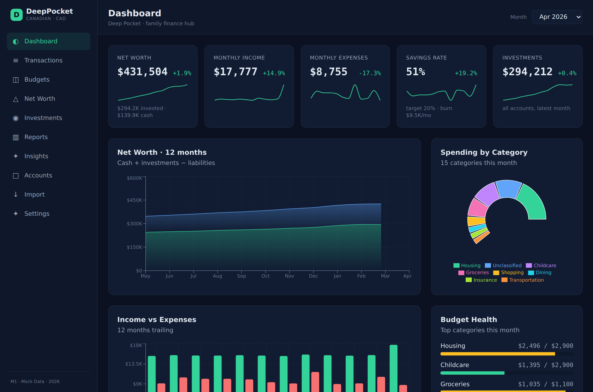

---

## 2. Transactions

Every transaction, with search + month/account/category filters. Inflow and outflow totals
for the current filter show on the right.

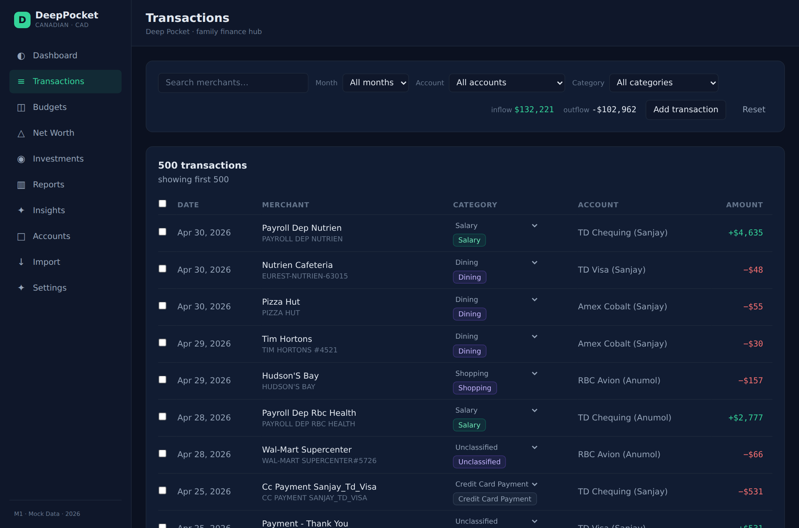

### 2.1 Recategorize a transaction

Pick a new category from the **Category** dropdown on any row — it saves immediately. After
a change, an inline prompt offers to turn it into a rule (*"Always categorize X as Y?"*) so
future imports auto-apply it. Click a row's merchant to expand an editor for **notes, tags,
and the transfer/duplicate flags**.

### 2.2 Add a cash or missed transaction

Click **Add transaction** to open the entry form. Choose an account (defaults to the seeded
**Cash** wallet), a date, merchant, amount (expense or income), and optionally a category
(**Auto** lets the app categorize it). Manually-added rows carry a `manual` badge and are
fully editable and deletable later — bank-imported rows keep their facts locked.

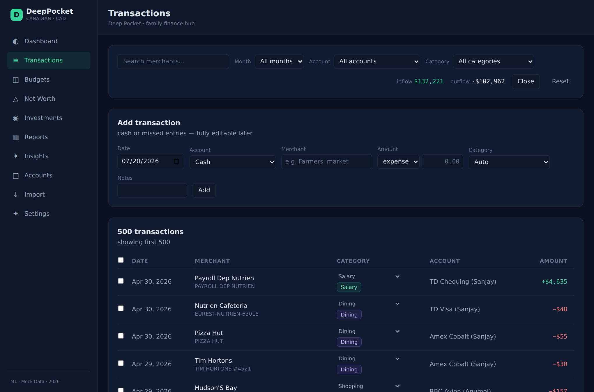

### 2.3 Bulk actions

Tick the checkboxes on the left of each row (or the header box to select the whole filtered
list). A bulk action bar appears: **Recategorize** the selection to any category, **Mark
transfer**, **Mark duplicate**, or **Delete** (deletes manual rows only — bank rows are
reported as skipped). **Clear** deselects everything.

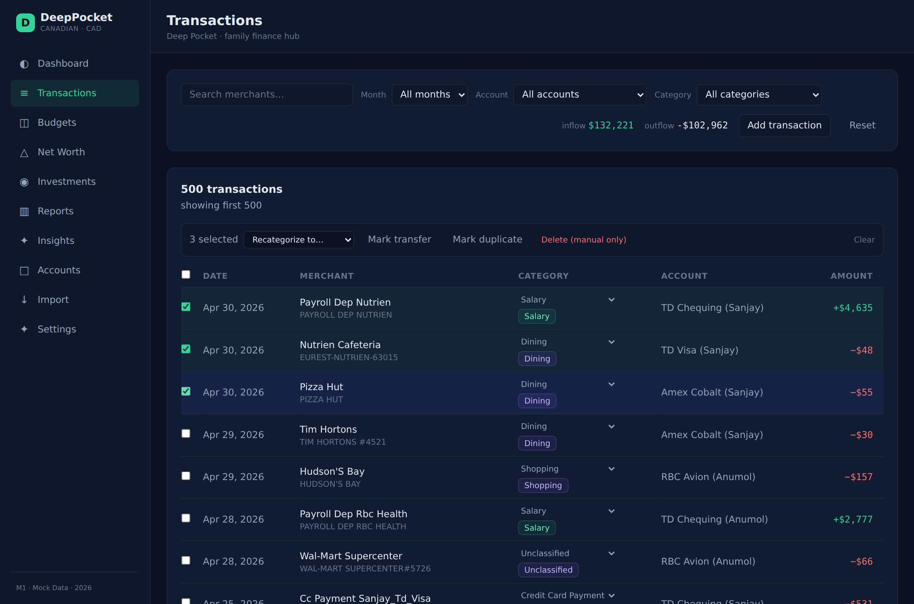

---

## 3. Budgets

Switch between **Envelope**, **Zero-based**, and **50/30/20** modes (the choice persists).
The category table shows budgeted vs spent, remaining, and progress.

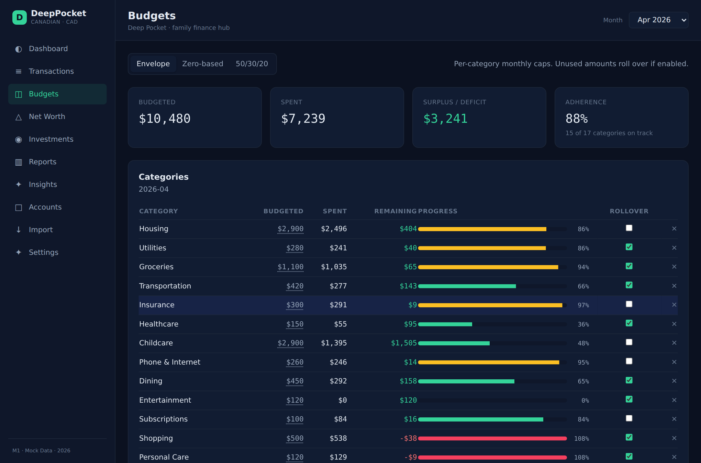

### 3.1 Edit a cap, rollover, or lines

Click a **Budgeted** amount to edit the monthly cap inline (Enter to save, Esc to cancel).
In Envelope mode, toggle **rollover** per category. Use the **✕** on a row to remove its
budget line, or the **Add category to budget** row beneath the table to add one.

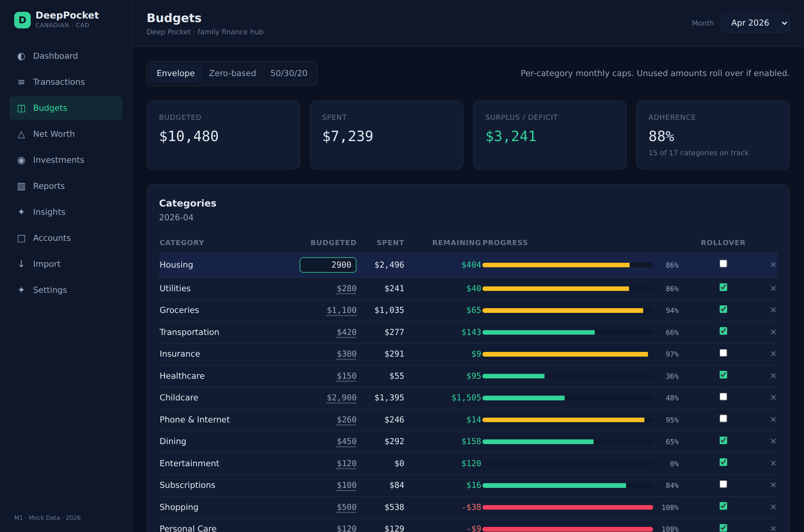

---

## 4. Categories (Settings)

On the **Settings** page, the **Categories** card is full CRUD: add a category (name, group,
optional 50/30/20 bucket, essential flag), edit any row inline, or delete one. Deleting
cascades — its transactions move to **unclassified**, and its budget line and any rules
pointing at it are removed (the summary reports the counts). The `unclassified` category is
protected and can't be edited or deleted.

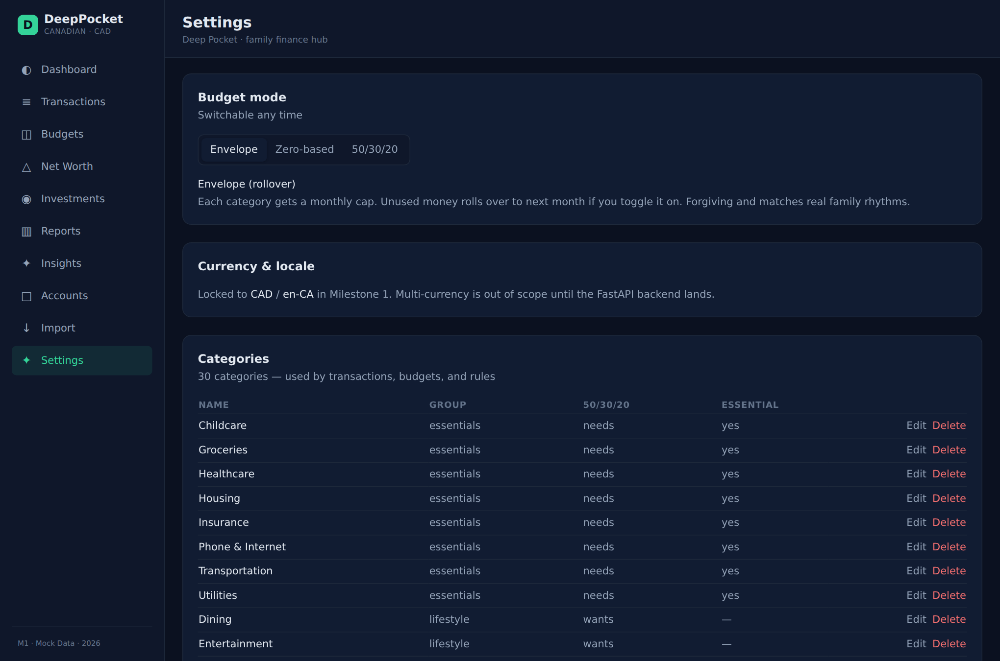

---

## 5. Importing transactions

The **Import** page has three cards: investments CSV, auto-detected bank/credit-card CSV,
and the column-mapping wizard. Re-importing the same rows is always safe — duplicates are
detected and skipped.

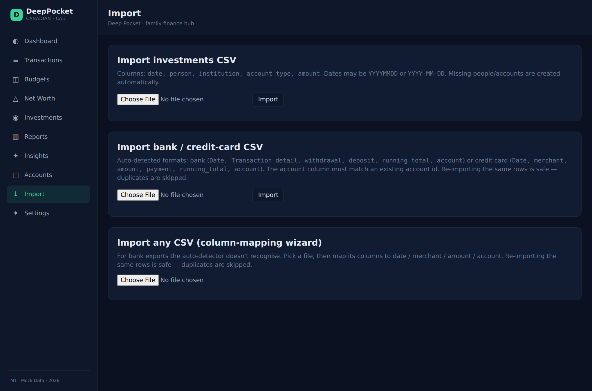

### 5.1 Auto-detected bank / credit-card CSV

If your export matches one of the two known shapes (bank: `Date, Transaction_detail,
withdrawal, deposit, running_total, account`; or credit card: `Date, merchant, amount,
payment, running_total, account`), just pick the file and click **Import**. The `account`
column must match an existing account id.

### 5.2 Column-mapping wizard (any CSV)

For any other export, use **Import any CSV (column-mapping wizard)**:

1. **Pick a file.** The wizard reads the header row and shows a preview of the first few
   rows, plus the total row count.
2. **Map the columns.** The wizard pre-fills its best guesses. Confirm the **Date** and
   **Merchant** columns. For **Amount**, choose a *Single column* (with an optional sign
   flip if the file uses positive-for-expense) or a *Debit / credit* split. For **Account**,
   pick a *Fixed* account for every row, or map an account-id column with *From column*.
   Tick **Dates are day-first** if the file uses DD/MM/YYYY.

   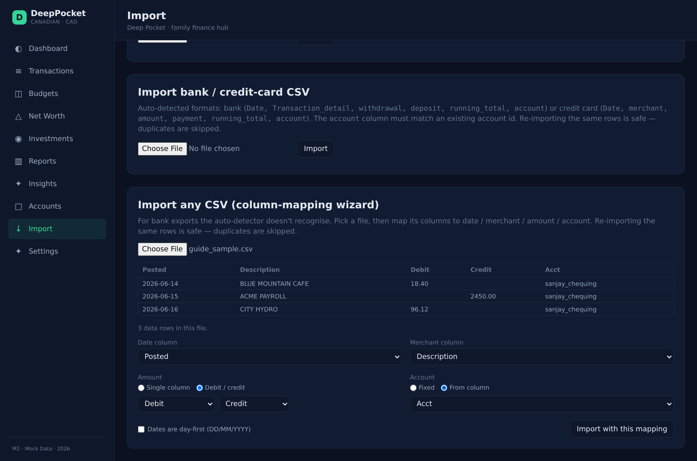

3. **Import.** Click **Import with this mapping**. The summary reports created / duplicates /
   skipped, plus how rows were categorized (history / rules / unclassified) and any per-row
   errors.

   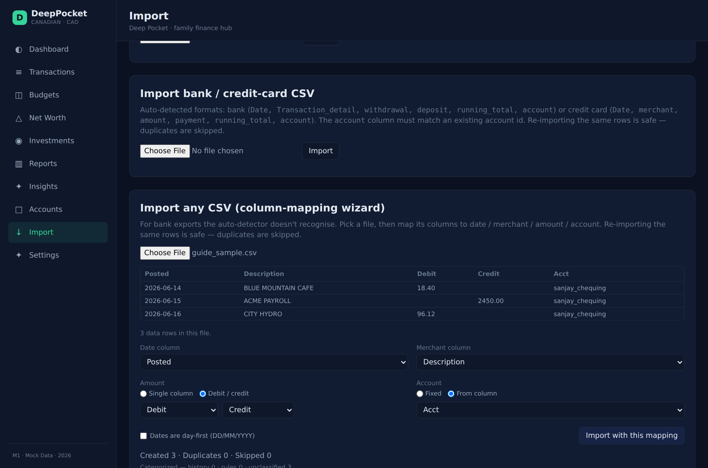

---

## 6. Net Worth

Headline net worth over time, an area chart of the trend, a breakdown by account kind
(chequing, savings, cash, registered accounts, etc.), and a per-person split.

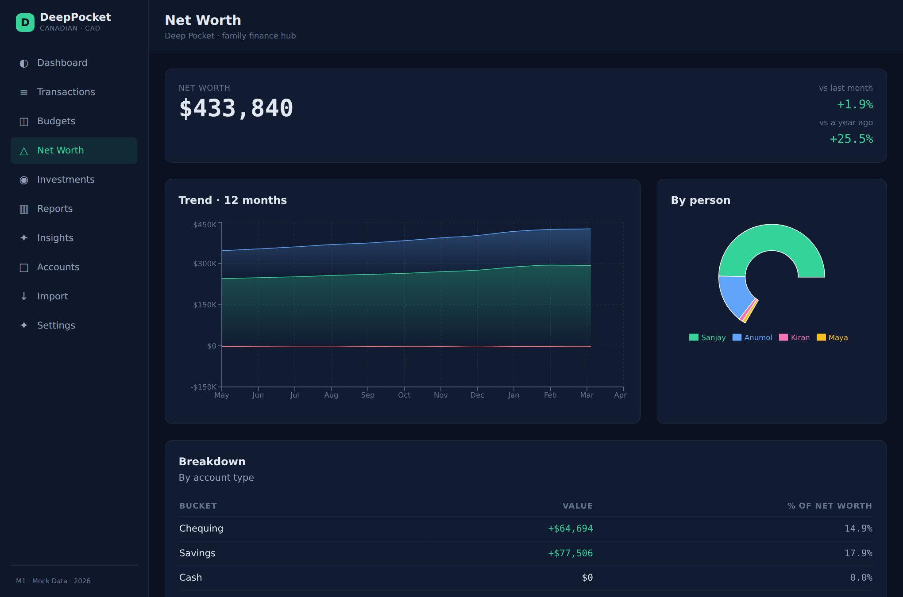

---

## Other screens

- **Investments** — registered-account snapshots, contribution room against 2025 CRA limits,
  and the per-child RESP → CESG grant dashboard (CESG is derived, never hand-entered).
- **Insights** — top merchants, recurring subscriptions, spending heatmap.
- **Reports** — tabbed charts over the selected period.
- **Accounts** — all accounts grouped by kind.
- **Settings** — household & investment accounts, budget mode, categorization rules
  (with inline keyword editing), categories, and danger-zone data purges.

_Screenshots generated with Playwright against the demo dataset; regenerate with
`node docs/guide/generate-screenshots.mjs` while both servers are running._
